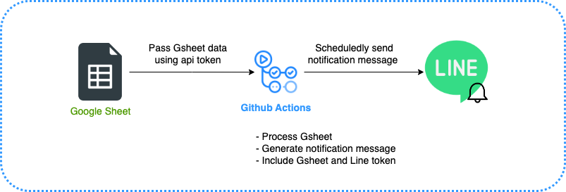

# Gsheet-Notify-Line
Long story short, this repo includes a Github Actions workflow and a simple python program.

The python program calculate previous week expense from a Gsheet in my personal account.

(I use Google Forms connecting to Google Sheet for manually recording my expense)

Github Actions request the data from Gsheet, run the python program to summarize expense and generate message, finally notify me with the message. 

This procedure shows as follows.

## Weekly Expense Notification Workflow

    

